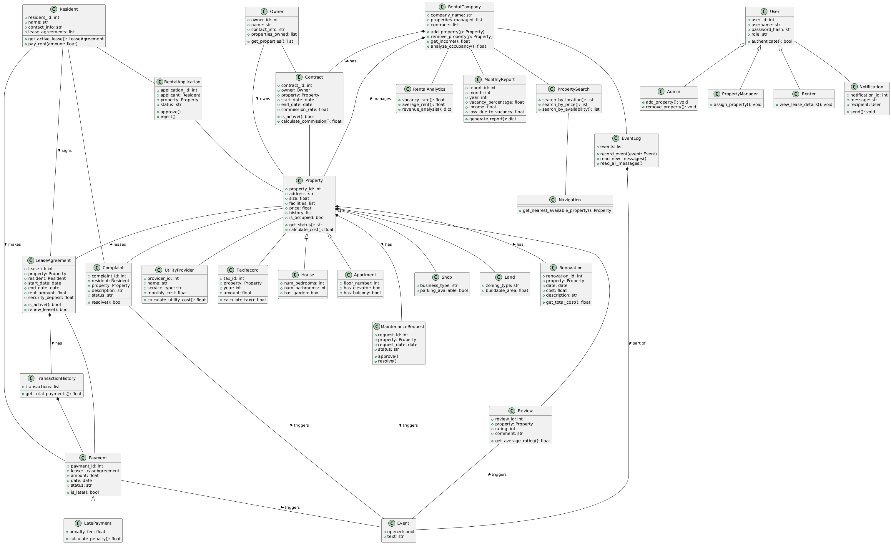

[](https://classroom.github.com/a/lhugoKrd)
# Programming II - Assignment 1

**Exercise**: Object-Oriented Programming with Python  

**Due Date**: 21.04.2025, 23:59:59 (CEST)

You are hired by a rental company to develop a system that manages rental properties. The company manages properties such as houses, apartments, shops, and land on behalf of property owners. The system should: 

- Keep track of rental properties, their attributes (address, size, price, facilities, history, etc.), and their occupancy status (occupied or vacant). 
- Track rental contracts between property owners and the rental company. 
- Monitor residents, their leases, payments, and overdue payments. 
- Perform analytics, such as occupancy rates, revenue generation, overdue payments, and rental turnover. 

You are given a UML class diagram as a reference (see [uml-class-diagram.png](uml-class-diagram.png)), implement the classes with correct attributes, methods, and relationships. Use appropriate inheritance to avoid code duplication. Create test cases to ensure functionalities work as expected. Write Python scripts that demonstrate searching properties, assigning residents, and generating reports. 

> [!CAUTION]
> The UML class diagram is mostly complete, but some links and attributes are missing (e.g. between `Renter` and `Resident`)

## Deliverables
By the end of the project, students should submit a GitHub Repository containing: 
1. Python scripts for all implemented classes and functionality. 
2. Test cases demonstrating correct behavior. 
3. A sample execution script that simulates a full rental management workflow. 

> [!CAUTION]
> Learn to use Github and commit + push frequently! "All my data is lost because my computer broke" is not acceptable.

## Tasks

[](uml-class-diagram.png)

### 🛠 Task 1: Basic Class Structure  
**Define the Class Structure based on the UML diagram (The given UML class diagram must be entirely implemented, additional classes are permitted)**
- Implement all the classes, with the correct relationships between them.  
- Implement the basic functionality, demonstrating lease management, including **creating, renewing, and terminating** leases. 

**Deliverables**: Python files with class definitions and inheritance properly structured. 


### 🛠 Task 2: Payment System 

- Implement Payment class to track **rent payments**, including amount, date, and status.  
- Create LatePayment (inherits from Payment) to handle **overdue payments with penalties**.  
- Implement a TransactionHistory class to **store all payment transactions**.  
- Write a method to check **unpaid rent** and notify residents. 

**Deliverables**: A script that processes rent payments, identifies late payments, calculates total revenue. 


### 🛠 Task 3: Property Maintenance & Renovations 
- Create a MaintenanceRequest class to handle repair requests.  
- Implement a Renovation class to track renovation history and costs.  
- Allow a property manager to approve or reject maintenance requests. 

**Deliverables**: A maintenance management script that handles submitting and resolving requests. 


### 🛠 Task 4: Analytics & Reports 
- Write methods to analyze data and generate reports: 
- Calculate the percentage of vacant properties (RentalAnalytics.vacancy_rate()). 
- Calculate total rental income per month (RentalAnalytics.average_rent()). 
- Identify the number of rental turnovers per month (RentalAnalytics.tenant_turnover_rate()). 
- Calculate the financial loss from vacant properties (RentalAnalytics.loss_due_to_vacancy()). 
- Generate a monthly report (MonthlyReport.generate_report()). 

**Deliverables**: A script that prints analytics reports for a given month/year. 


### 🛠 Task 5: Searching & Navigation 
- Implement PropertySearch with methods: search_by_location(), search_by_price(), search_by_availability(). 
- Implement Navigation to help find the nearest available property. 

**Deliverables**: A search function where users can find available properties based on criteria. 

### 🛠 Task 6: Event Logging & Notifications 
- Implement an EventLog to record system events (e.g., lease signed, rent paid). 
- Implement Notification to send messages for lease expirations, late payments, etc. 

**Deliverables**: A script that sends notifications to renters about late payments. 


### 🛠 Task 7: Reviews & Complaints System 
- Create a Review class to allow residents to rate properties. 
- Implement a Complaint system where renters can file complaints. 

**Deliverables**: A review and complaint submission system. 


---
## Technical Hints


### Python Version
You will (probably) not need any special features related to specific Python versions to complete this exercise.
The sample code provided by us was developed in Python v3.8 for general compatibility.
Feel free, however, to use a newer version (e.g. 3.9, 3.10, 3.11) to benefit from new functionality.


###  Testing with [pytest](https://docs.pytest.org/)

You will need to install pytest, to execute your code.
To trigger the automated tests, execute
```bash
pytest
```

Note, that your `print` statements will not be visible, 
unless you add the `-s` argument to the call, i.e. `pytest -s`.

